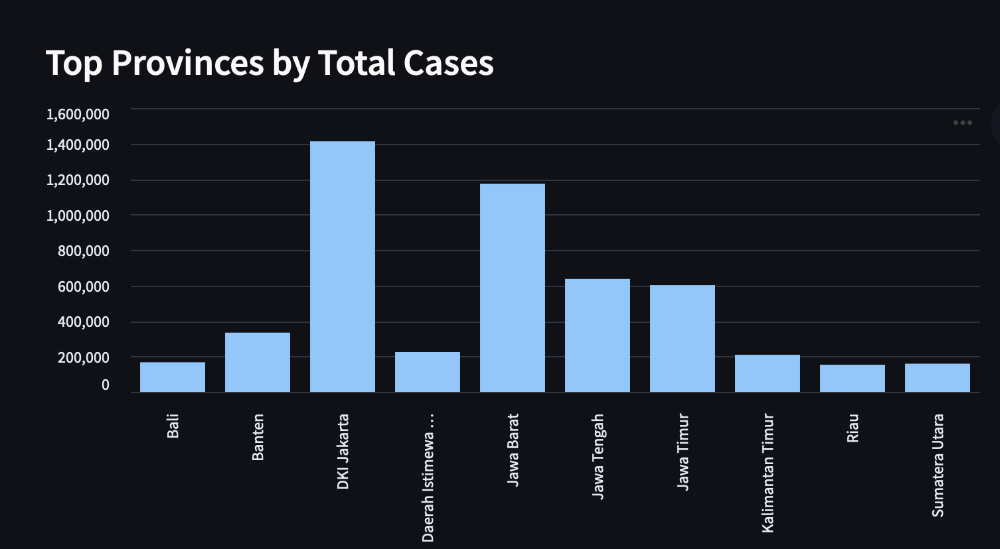
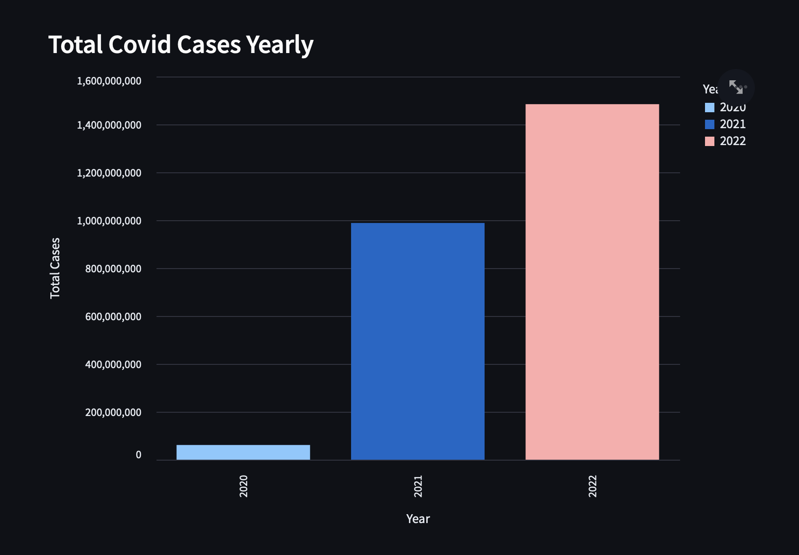

  # Indonesia: COVID-19 Analytics Dashboard


## Overview
The **COVID-19 Analytics Dashboard** for Indonesia is an interactive visualization tool developed using **Streamlit**, **Plotly**, and **Altair**. This dashboard allows users to explore key metrics related to the spread of COVID-19 across various regions in Indonesia. With filtering options for location, year, month, and day, the dashboard provides insights into trends like total cases, active cases, recovered cases, and deaths. It also visualizes key data points through charts such as bar charts, pie charts, heatmaps, and more.

## Objectives
- **Explore COVID-19 trends**: View COVID-19 trends over time with interactive visualizations.
- **Regional analysis**: Visualize COVID-19 metrics across different locations and provinces in Indonesia.
- **Key Performance Indicators (KPIs)**: Display vital statistics like total cases, active cases, recovered cases, and deaths.
- **In-depth analysis**: Visualize the relationship between population density and COVID-19 cases using heatmaps and pie charts.

## Features
- **Filters**: Allows the user to select multiple locations, years, months, and days to filter the data.
- **Key Performance Indicators (KPIs)**: Displays metrics like total cases, active cases, recovered cases, and deaths.
- **Interactive Charts**: Includes bar charts, pie charts, and heatmaps to visualize COVID-19 data.
- **Location-wise Analysis**: Analyze COVID-19 data for different regions and visualize the infection rate using pie charts.
- 
## Demo Screenshot


## Technologies Used

- **Python**: Core language for data manipulation and dashboard development.
- **Streamlit**: Framework for building the interactive dashboard.
- **Pandas**: For data manipulation and processing.
- **Altair & Plotly**: For data visualization and charts.
- **Seaborn & Matplotlib**: For additional plotting, especially heatmaps.

## Instructions for Running the Application Locally

### Prerequisites
Ensure that you have the following installed on your local machine:
- **Python** (version 3.7 or higher)
- **Streamlit**
- **Pandas**
- **Plotly**
- **Altair**
- **Seaborn**

You can install the required packages by running the following command:

pip install streamlit pandas plotly altair seaborn


## Steps to Run the Streamlit Application

1. **Clone the repository or download the project files:**

   - To **clone** the repository using Git, run the following command in your terminal:
     ```bash
     git clone https://github.com/your-username/Indonesia-Covid19_Analytics_Dashboard.git
     ```
     *(Replace `your-username` with your actual GitHub username)*

   - Alternatively, you can **download the ZIP file** from the GitHub repository and extract it to your local machine.

2. **Navigate to the project directory:**

   - Open a terminal or command prompt.
   - Use the `cd` command to navigate to the folder where the `app.py` (or the script with your Streamlit app) is located. For example:
     ```bash
     cd path/to/Indonesia-Covid19_Analytics_Dashboard
     ```

   - Ensure the `app.py` or main script file is located in this directory.

4. **Run the Streamlit app:**

   Once dependencies are installed, run the following command to start the Streamlit app:
   ```bash
   streamlit run app.py


